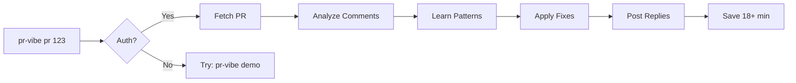

# pr-vibe 🎵

[](https://www.npmjs.com/package/pr-vibe)
[](https://opensource.org/licenses/MIT)
[](https://github.com/stroupaloop/pr-vibe/actions/workflows/test.yml)
[](https://github.com/stroupaloop/pr-vibe/security/code-scanning)
[](https://github.com/stroupaloop/pr-vibe)
[](https://www.npmjs.com/package/pr-vibe)
[](https://github.com/stroupaloop/pr-vibe)
[](https://github.com/stroupaloop/pr-vibe/pulls)

> 🎵 When AI tools vibe together on your PRs. Let CodeRabbit and Claude Code handle the repetitive feedback while you ship features.

Built BY an AI (Claude) FOR AIs to orchestrate - the first tool designed for AI-to-AI collaboration on code reviews.

## Try it Now - Zero Setup! 🚀

```bash
npx pr-vibe@latest demo
```

No tokens, no setup, just instant value. See pr-vibe handle real bot comments in 30 seconds.

Visit our [interactive demo](https://stroupaloop.github.io/pr-vibe/) for more.

## Why pr-vibe?

PR review bots like CodeRabbit and DeepSource are great, but they don't understand *your* project. You find yourself:
- Explaining why `console.log` is valid in Lambda functions... again
- Rejecting the same "any types" warnings for complex webhooks
- Manually fixing the same security issues they flag

pr-vibe bridges this gap by:
- 🤝 **Working WITH bots** - Enhances CodeRabbit, DeepSource, etc. rather than replacing them
- 🧠 **Learning your patterns** - Remembers your project's conventions and valid exceptions
- ⚡ **Automating responses** - Fixes what should be fixed, explains what's intentional
- 🎯 **Saving time** - Handle bot comments in seconds, not minutes

## Features

- 🔍 **Bot Comment Analysis** - Parses and understands comments from all major PR review bots
- 💬 **Intelligent Responses** - Maintains conversation context across bot exchanges  
- 🛠️ **Smart Actions** - Auto-fix simple issues, explain valid patterns, or escalate edge cases
- 🧠 **Project Memory** - Learns and remembers your project-specific patterns
- 🔌 **LLM Flexibility** - Works with Claude, GPT-4, Gemini, or local models
- ⚡ **CLI First** - Full control with human-in-the-loop design

## Installation

```bash
# Try instantly - no setup required!
npx pr-vibe@latest demo

# Install globally when ready
npm install -g pr-vibe
```

## Getting Started

### 🎯 Option 1: Try Without Setup (Recommended)
```bash
# See pr-vibe in action instantly
npx pr-vibe@latest demo
```

### 🚀 Option 2: Quick Setup (2 minutes)

1. **Install pr-vibe:**
   ```bash
   npm install -g pr-vibe
   ```

2. **Let pr-vibe find your GitHub auth:**
   ```bash
   pr-vibe auth status
   ```
   
   pr-vibe automatically detects tokens from:
   - ✅ GitHub CLI (`gh auth login`)
   - ✅ Environment variables
   - ✅ VS Code GitHub extension
   
   No token? Run `pr-vibe auth` for guided setup.

3. **Review your PR:**
   ```bash
   pr-vibe pr 42
   ```

That's it! pr-vibe learns from every decision you make.

## Commands

```bash
# Try demo - no setup needed!
pr-vibe demo

# Check your auth status
pr-vibe auth

# Review bot comments interactively
pr-vibe pr 42

# Export for Claude/ChatGPT analysis
pr-vibe export 42 --format claude

# Apply AI decisions
pr-vibe apply 42 -d decisions.json

# Initialize patterns for your project
pr-vibe init
```

## How It Works



1. **Smart Auth** - Finds your token automatically
2. **Fetches** bot comments from your PR
3. **Analyzes** with learned patterns
4. **Fixes** what can be automated
5. **Explains** your valid patterns
6. **Learns** from every decision

## Real Impact 📊

From actual usage on the woodhouse-modern project:

```bash
$ pr-vibe apply 20

# Analyzing 19 bot comments from CodeRabbit...

✓ Applying learned patterns...

  🔧 Auto-fixed 7 issues:
     • hardcoded API key → process.env.API_KEY
     • console.log statements → logger.info()
     • magic number 404 → HTTP_STATUS.NOT_FOUND

✓ Auto-replied to 12 valid patterns:
     • "console.log valid for CloudWatch in Lambda" (3x)
     • "any types acceptable in webhook handlers" (2x)
     • "TODOs tracked in Jira, not removed" (4x)

⚡ Completed in 1m 47s
📊 19 comments handled automatically
⏱️  Saved ~18 minutes of manual work
💰 Time saved: $45-90 (based on dev hourly rate)
```

**After ~10 PRs:** pr-vibe handles 95% of repetitive feedback automatically!

> 💡 **Pro tip:** Start with `pr-vibe demo` to see the magic before setting up auth.

## Pattern Learning

pr-vibe gets smarter with each PR. After ~10 PRs, it handles 95% of repetitive feedback automatically.

```yaml
# .pr-bot/patterns.yml - Learns from your decisions
version: 1.0
project: awesome-app

valid_patterns:
  - id: console-cloudwatch
    pattern: "console.log"
    condition:
      files: ["**/lambda/**"]
    auto_reply: "We use console.log for CloudWatch logging"
    confidence: 0.98

auto_fixes:
  - trigger: "hardcoded.+(api|key|token)"
    severity: CRITICAL
    fix_template: |
      const {{CONST_NAME}} = process.env.{{ENV_NAME}};
```

## Supported LLMs

- **Anthropic Claude** (Claude 3 Opus, Sonnet, Haiku)
- **OpenAI** (GPT-4, GPT-3.5)
- **Google** (Gemini Pro)
- **Ollama** (Local models)
- **Custom** (Any OpenAI-compatible API)

## The Vibe Philosophy

This isn't just a tool - it's a vibe. Built BY an AI (Claude) specifically FOR AI-to-AI collaboration.

**Why it matters:**
- 🤖 **AI-Native Design** - Tools understand each other better
- 🎵 **Harmony Over Conflict** - Work WITH bots, not against them
- 🌊 **Flow State Protected** - Stay focused on creative work
- 💜 **Community Patterns** - Learn from the collective

## Supported Review Bots

- **CodeRabbit** - Full comment parsing and thread tracking
- **DeepSource** - Issue categorization and auto-fix support
- **Sonar** - Code quality and security issue handling
- **Codacy** - Style and complexity feedback
- **GitHub Actions** (bot comments) - Workflow failure explanations
- More coming soon!

## Contributing

We welcome contributions! See [CONTRIBUTING.md](CONTRIBUTING.md) for guidelines.

## Support pr-vibe

Love the vibe? Here's how to help:

### 💜 Sponsor
- [GitHub Sponsors](https://github.com/sponsors/stroupaloop) - Support development
- ⭐ Star this repo - Help others discover pr-vibe
- 🐦 [Tweet about it](https://twitter.com/intent/tweet?text=Just%20discovered%20pr-vibe%20-%20AI%20tools%20vibing%20together%20on%20code%20reviews!%20Built%20BY%20an%20AI%20for%20AI%20collaboration%20🎵&url=https://github.com/stroupaloop/pr-vibe) - Spread the word

### 🤝 Contribute
We welcome contributions! See [CONTRIBUTING.md](CONTRIBUTING.md) for guidelines.

### 🏆 Contributors

<!-- ALL-CONTRIBUTORS-LIST:START - Do not remove or modify this section -->
<!-- prettier-ignore-start -->
<!-- markdownlint-disable -->
<!-- markdownlint-restore -->
<!-- prettier-ignore-end -->
<!-- ALL-CONTRIBUTORS-LIST:END -->

## Support

If pr-vibe saves you time, consider sponsoring development through GitHub Sponsors. Your support helps maintain and improve pr-vibe! 🎵

## License

MIT © [Andrew Stroup](https://github.com/stroupaloop) & [Claude (Anthropic)](https://claude.ai)

---

<p align="center">
  <i>Let the robots vibe together 🎵</i>
</p>

## Keywords

`ai` `code-review` `pr-automation` `coderabbit` `claude` `ai-tools` `developer-tools` `productivity` `automation` `bot-management` `pattern-learning` `vibe-coding` `ai-collaboration` `pull-request` `github-automation`